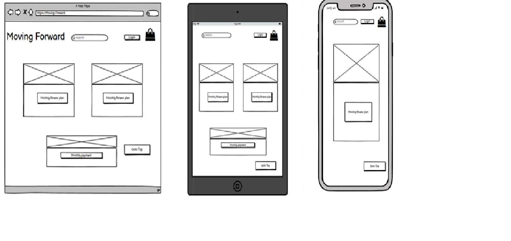

# **UX User Experience**

## **User Stories**

All pages on this website are responsive to desktop, iPad and, mobile screens. Every effort has been made om making this website to be as intuitive as possible.

- First Time Visitor Goals
- As a First Time Visitor, I want to easily find a fitness plan I want to start.
- As a First Time Visitor, I want to be able to easily navigate throughout the site to find content.
- As a First Time Visitor, I want to look for reviews to understand what their users think of them and see if they are trusted.

- Returning Visitor Goals
- As a Returning Visitor, I would like to write a review about a plan I have recently followed from the online store.
- As a Returning Visitor, I want to find the best way to get in contact with the organisation with any questions I may have.
- As a Returning Visitor, I would like to edit a plan review I added to the website.
- As a Returning Visitor, I would like to Remove a book review I added to the website.
- As a Returning Visitor, I would like to delete a review I left on a plan/purchase.

## **Wireframe Mockups:**
### Desktop&emsp;&emsp;&emsp;&emsp;&emsp;&emsp;&emsp;&emsp;&emsp;&emsp;&emsp;&emsp;&emsp;&emsp;&emsp;Tablet&emsp;&emsp;&emsp;&emsp;&emsp;&emsp;&emsp;&emsp;&emsp;&emsp;Mobile

